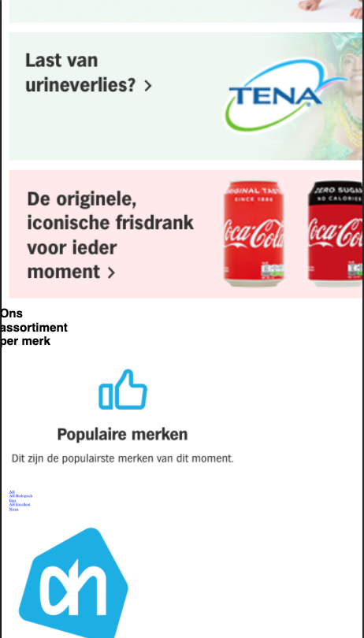
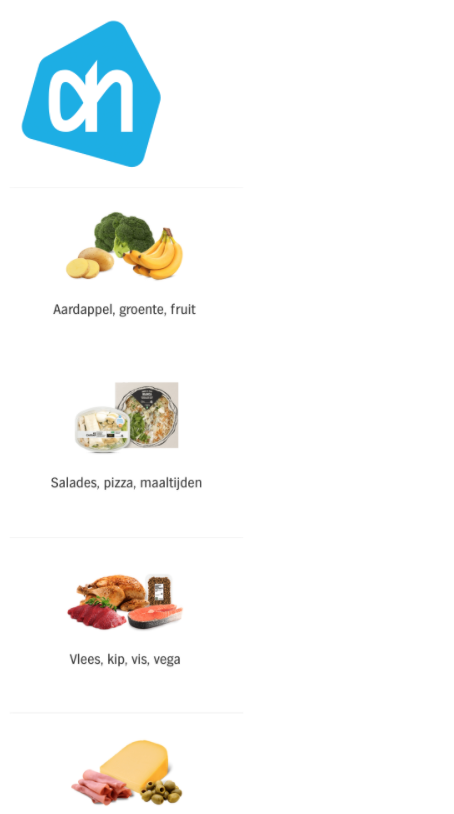
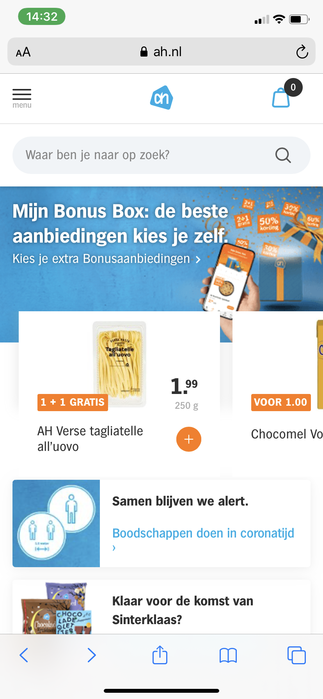
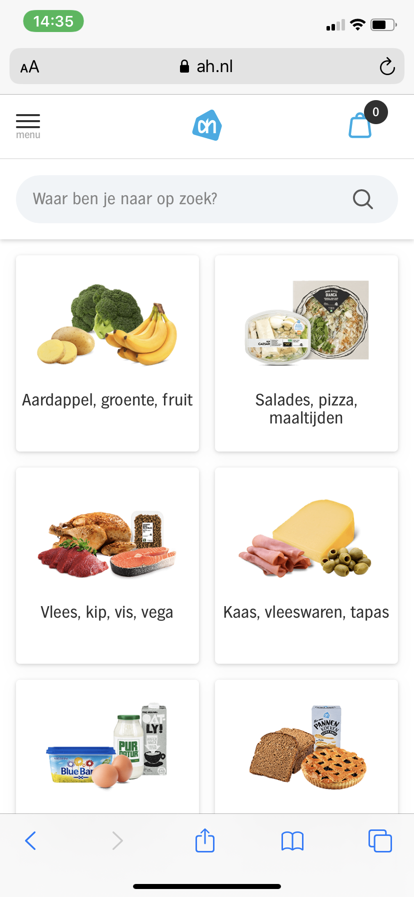

# Procesverslag
**Auteur:** Anne Kemme

Markdown cheat cheet: [Hulp bij het schrijven van Markdown](https://github.com/adam-p/markdown-here/wiki/Markdown-Cheatsheet). Nb. de standaardstructuur en de spartaanse opmaak zijn helemaal prima. Het gaat om de inhoud van je procesverslag. Besteedt de tijd voor pracht en praal aan je website.

## Bronnenlijst
1. -bron 1-
2. -bron 2-
3. -...-

## Eindgesprek (week 7/8)

-dit ging goed & dit was lastig-

**Screenshot(s):**

-screenshot(s) van je eindresultaat-

## Voortgang 3 (week 6)

-same as voortgang 1-

## Voortgang 2 (week 5)

-same as voortgang 1-

## Voortgang 1 (week 3)

### Stand van zaken

Met HTML werken gaat mij nog goed af. Ik merk dat ik het lastig vind om CSS al toe te voegen en vooral hoe ik goed de afbeeldingen naar elkaar krijg. 

**Screenshot(s):**

-screenshot(s) van hoe ver je bent met korte uitleg-

### Agenda voor meeting

-samen met je groepje opstellen-

| Student 1 - Zoe | Student 2 - Maryem | Student 3 - Anne | Student 4 - Sem |
| ---            | ---                | ---          | ---              |
| Mijn website  | Mijn website  | Mijn website  | Mijn website  |
| Breakpoint | Slider | Waar kan ik het best mee beginnen | Menu en nav |
| Product slider | Uitklappen van menu | Zoekbalk en animatie menu  | Automatische letter slider

### Verslag van meeting

-na afloop snel uitkomsten vastleggen-

## Breakdownschets (week 1)

-uitwerken voor de 1e werkgroep - eind van de eerste week-

## Intake (week 1)
-uitwerken voor de kick-off werkgroep - begin van de eerste week-

**Je startniveau:** Blauwe piste, ik blijf het lastig vinden om codes te schrijven. Als ik er aan werk vind ik het wel altijd heel leuk. Vaak met een beetje hulp lukt het mij wel. 

**Je focus:** Ik ga voor helemaal responsive. Ik zou ook voor beide willen gaan maar eerst wil ik het helemaal responsive maken. 

**Je opdracht:** https://www.ah.nl/?gclid=CjwKCAiA17P9BRB2EiwAMvwNyEBfuG93pprFAd-8G5BQzXpJpKfwFBxP9aVb0hLAUR_4TAi5cwFD1hoCjJYQAvD_BwE

**Screenshot(s) van de eerste pagina (small screen):**

**Screenshot(s) van de tweede pagina (small screen):**

