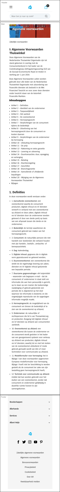
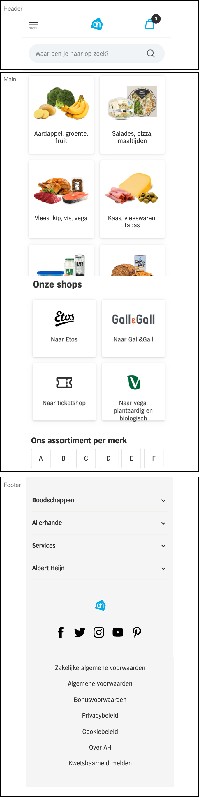
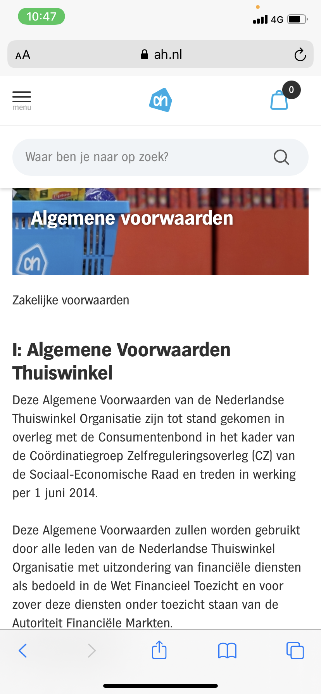

# Procesverslag
**Auteur:** Anne Kemme

Markdown cheat cheet: [Hulp bij het schrijven van Markdown](https://github.com/adam-p/markdown-here/wiki/Markdown-Cheatsheet). Nb. de standaardstructuur en de spartaanse opmaak zijn helemaal prima. Het gaat om de inhoud van je procesverslag. Besteedt de tijd voor pracht en praal aan je website.

## Bronnenlijst
1. https://www.ah.nl/

## Eindgesprek (week 7/8)

-dit ging goed & dit was lastig-

Uiteindelijk ben ik heel blij met het eindresulaat. Wanneer ik er echt voor ga zitten lukt het mij. Ik vind het lastig om te onthouden waar je precies bent gebleven en begin dan eigenlijk weer opnieuw. Ik heb gemerkt dat ik nog veel moeite heb met CSS. Niet persee met het gebruiken maar hoe je precies aangeeft wat nodig is. Ik heb aan de hand van het voorbeeld dat gestuurd was de menuknop gemaakt. 

**Screenshot(s):**

-screenshot(s) van je eindresultaat-

## Voortgang 3 (week 6)

Ik ben nog niet ver. Ik vind het lastig om er weer opnieuw aan te beginnen, ik ben dan namelijk vergeten waar ik was. Ik moet een planning gaan maken zodat ik niet te ver achterloop. 

## Voortgang 2 (week 5)

### Stand van zaken

Ik merk dat ik zeker achterloop. Ik had niet verwacht dat ik er zoveel moeite mee zou hebben. Ik ga een planning maken zodat ik volgende week en in de vakantie goed aan de slag ga. 

**Screenshot(s):**

### Agenda voor meeting

| Student 1 - Zoe | Student 2 - Maryem | Student 3 - Anne | Student 4 - Sem |
| ---            | ---                | ---          | ---              |
| Elementen voor nav  | Menu/nav  | Tekst in afbeelding  | Paralex scrol in afbeelding  |
| - | Content na nav | Div in goed container | Slider animatie |
| - | Hoeveelheid h1 | Breakdownschets controleren  | Flexbox layout |
| - | Hoeveelheid css | -  | - |
| - | Bronnen | -  | -

## Voortgang 1 (week 3)

### Stand van zaken

Met HTML werken gaat mij nog goed af. Ik merk dat ik het lastig vind om CSS al toe te voegen en vooral hoe ik goed de afbeeldingen naar elkaar krijg. 

**Screenshot(s):**

### Agenda voor meeting

-samen met je groepje opstellen-

| Student 1 - Zoe | Student 2 - Maryem | Student 3 - Anne | Student 4 - Sem |
| ---            | ---                | ---          | ---              |
| Mijn website  | Mijn website  | Mijn website  | Mijn website  |
| Breakpoint | Slider | Waar kan ik het best mee beginnen | Menu en nav |
| Product slider | Uitklappen van menu | Zoekbalk en animatie menu  | Automatische letter slider

### Verslag van meeting

-na afloop snel uitkomsten vastleggen-

## Breakdownschets (week 1)

-uitwerken voor de 1e werkgroep - eind van de eerste week-

## Intake (week 1)
-uitwerken voor de kick-off werkgroep - begin van de eerste week-

**Je startniveau:** 
Blauwe piste, ik blijf het lastig vinden om codes te schrijven. Als ik er aan werk vind ik het wel altijd heel leuk. Vaak met een beetje hulp lukt het mij wel. 

**Je focus:** 
Ik ga voor helemaal responsive. Ik zou ook voor beide willen gaan maar eerst wil ik het helemaal responsive maken. 

**Je opdracht:** 
https://www.ah.nl/?gclid=CjwKCAiA17P9BRB2EiwAMvwNyEBfuG93pprFAd-8G5BQzXpJpKfwFBxP9aVb0hLAUR_4TAi5cwFD1hoCjJYQAvD_BwE

**Screenshot(s) van de eerste pagina (small screen):**

**Screenshot(s) van de tweede pagina (small screen):**

